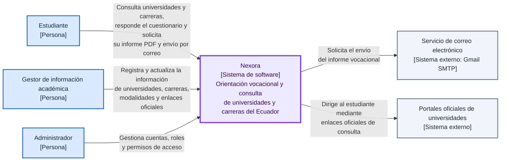

# C4 — Nivel 1: Contexto de Nexora

```mermaid
flowchart LR
    E["Estudiante<br/>[Persona]"]

    G["Gestor de información académica<br/>[Persona]"]

    A["Administrador<br/>[Persona]"]

    N["Nexora<br/>[Sistema de software]<br/>Orientación vocacional y consulta<br/>de universidades y carreras del Ecuador"]

    C["Servicio de correo electrónico<br/>[Sistema externo: Gmail SMTP]"]

    P["Portales oficiales de universidades<br/>[Sistema externo]"]

    E -->|"Consulta universidades y carreras,<br/>responde el cuestionario y solicita<br/>su informe PDF y envío por correo"| N

    G -->|"Registra y actualiza la información<br/>de universidades, carreras,<br/>modalidades y enlaces oficiales"| N

    A -->|"Gestiona cuentas, roles<br/>y permisos de acceso"| N

    N -->|"Solicita el envío<br/>del informe vocacional"| C

    N -->|"Dirige al estudiante mediante<br/>enlaces oficiales de consulta"| P

    classDef persona fill:#DBEAFE,stroke:#1565C0,stroke-width:2px,color:#102A43;
    classDef sistema fill:#EDE9FE,stroke:#7C3AED,stroke-width:3px,color:#3B0764;
    classDef externo fill:#F1F5F9,stroke:#64748B,stroke-width:2px,color:#1E293B;

    class E,G,A persona;
    class N sistema;
    class C,P externo;
```