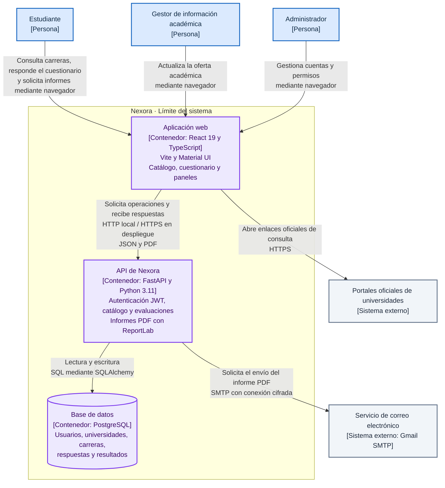

# C4 — Nivel 2: Contenedores de Nexora

```mermaid
flowchart TB
    E["Estudiante<br/>[Persona]"]

    G["Gestor de información académica<br/>[Persona]"]

    A["Administrador<br/>[Persona]"]

    subgraph N["Nexora · Límite del sistema"]
        W["Aplicación web<br/>[Contenedor: React 19 y TypeScript]<br/>Vite y Material UI<br/>Catálogo, cuestionario y paneles"]

        API["API de Nexora<br/>[Contenedor: FastAPI y Python 3.11]<br/>Autenticación JWT, catálogo y evaluaciones<br/>Informes PDF con ReportLab"]

        DB[("Base de datos<br/>[Contenedor: PostgreSQL]<br/>Usuarios, universidades, carreras,<br/>respuestas y resultados")]

        W -->|"Solicita operaciones y recibe respuestas<br/>HTTP local / HTTPS en despliegue<br/>JSON y PDF"| API

        API -->|"Lectura y escritura<br/>SQL mediante SQLAlchemy"| DB
    end

    P["Portales oficiales de universidades<br/>[Sistema externo]"]

    C["Servicio de correo electrónico<br/>[Sistema externo: Gmail SMTP]"]

    E -->|"Consulta carreras, responde el cuestionario<br/>y solicita informes mediante navegador"| W

    G -->|"Actualiza la oferta académica<br/>mediante navegador"| W

    A -->|"Gestiona cuentas y permisos<br/>mediante navegador"| W

    W -->|"Abre enlaces oficiales de consulta<br/>HTTPS"| P

    API -->|"Solicita el envío del informe PDF<br/>SMTP con conexión cifrada"| C

    classDef persona fill:#DBEAFE,stroke:#1565C0,stroke-width:2px,color:#102A43;
    classDef contenedor fill:#EDE9FE,stroke:#7C3AED,stroke-width:2px,color:#3B0764;
    classDef externo fill:#F1F5F9,stroke:#64748B,stroke-width:2px,color:#1E293B;

    class E,G,A persona;
    class W,API,DB contenedor;
    class C,P externo;
```